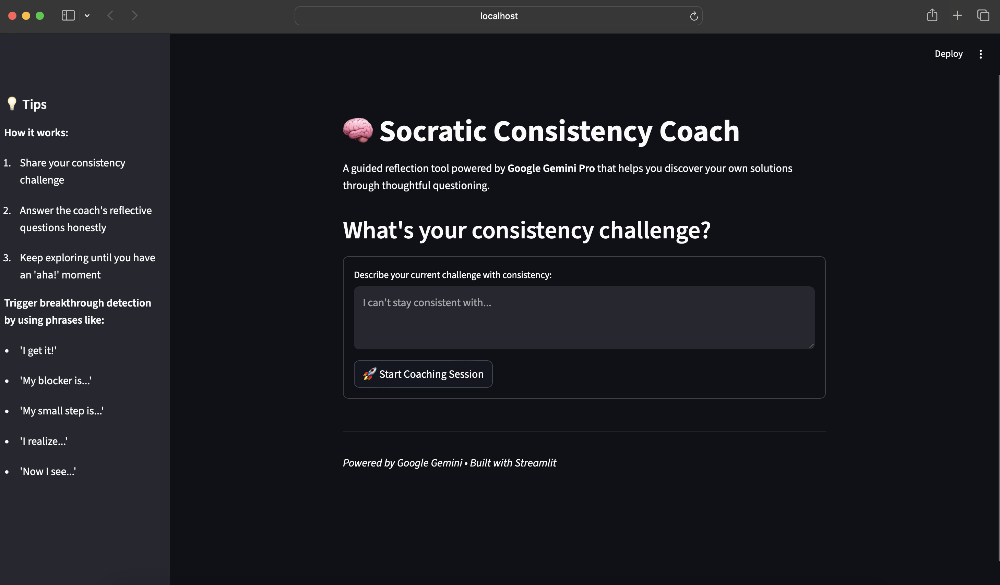

# OpenAI API + Streamlit Demo

This project demonstrates how to integrate **OpenAI APIs** with a **Streamlit** frontend application.  
It allows you to interact with OpenAI’s powerful language models and test API responses directly through a simple web UI.

---

## 🚀 Features
- Integration with **OpenAI API**
- Built using **Streamlit** for the frontend
- Secure handling of API keys using **`secrets.toml`**
- Easy to extend for custom use cases

---

## 📦 Installation

### 1. Clone the Repository
```bash
git clone https://github.com/your-username/openai-streamlit-demo.git
cd openai-streamlit-demo
```

2. Create a Virtual Environment
```bash
python -m venv venv
source venv/bin/activate   # On macOS/Linux
venv\Scripts\activate      # On Windows
```

3. Install Dependencies
```bash
pip install -r requirements.txt
```

🔑 API Key Setup

You need an OpenAI API key to use this project.
Follow these steps to configure it securely:

1. Create a folder named .streamlit in the root directory of the project
```bash
mkdir .streamlit
```
2. Inside .streamlit, create a file named secrets.toml:
```bash
   touch .streamlit/secrets.toml
```

3. Add your API key to the file:
```bash
# Copy this file to .streamlit/secrets.toml and add your real key.
OPENAI_API_KEY = "your_api_key_here"

```
⚠️ Important:

Never share your real API key publicly.

Do not commit secrets.toml to GitHub (add it to .gitignore).

▶️ Running the App
Once the setup is done, run the Streamlit app with:
```bash
   streamlit run app.py
```

🛠️ Project Structure
```bash
openai-streamlit-demo/
│
├── app.py                # Main Streamlit app
├── requirements.txt      # Dependencies
├── README.md             # Project documentation
└── .streamlit/
    └── secrets.toml      # API key storage (not committed to Git)
```

📌 Example Usage

Enter a prompt in the Streamlit UI.

The app will call the OpenAI API with your key.

You’ll see the model’s generated response instantly.


## 📸 Screenshots

### Home Page


